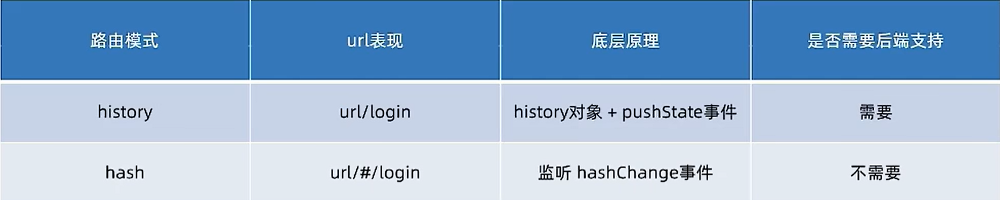

# 创建路由开发环境

```bash
npx create-react-app react-router
npm i
npm i react-router-dom
```
# 简单的路由配置

```jsx
import * as React from "react";
import * as ReactDOM from "react-dom/client";
import {
  createBrowserRouter,
  RouterProvider,
} from "react-router-dom";
import "./index.css";

const router = createBrowserRouter([
  {
    path: "/",
    element: <div>Hello world!</div>,
  },
]);

ReactDOM.createRoot(document.getElementById("root")).render(
  <React.StrictMode>
    <RouterProvider router={router} />
  </React.StrictMode>
)
```
# 路由导航

## 声明式导航

通常在菜单栏里使用 link标签进行路由跳转

```jsx
import {link} from "react-router-dom"

// 组件中,link标签会被解析成a标签
<link to="/article" />
```
## 编程式导航

通过 useNavigate Hook 得到导航方法，然后通过调用方法以命令的形式进行路由跳转。通常在逻辑代码中使用

```jsx
import {useNavigate} from "react-router-dom"
const navigate = useNavigate()
<button onClick={() => navigate("/article")}>跳转到文章页</button>
```
# 路由传参

## useSearchParams

```jsx
// 传递参数
navigate("/article?id=1001&name=jack")
// 接受参数
const [params] = useSearchParams()
const id = params.get("id")
```
## useParams

```jsx
// 路由配置
{
  path: "/article/:id",
  ...
}
// 传参
navigate('article/1001')
// 接受参数
const params = useParams()
const id = params.id
```
# 嵌套路由配置

1.使用children属性配置路由嵌套关系
2.使用`<Outlet />`组件配置二级路由出口

```jsx
// path配置
{
  path: '/'
  element: <Layout />
  children: [
    {
      // path: '/article',
      index: true, // 设置默认二级路由配置
      element: <Article />
    },
    {
      path: '/article/:id',
      element: <ArticleDetail />
    }
  ]
}
```
# 404路由配置

1.准备一个Not Found组件
2.在路由表末尾，以*(通配符)作为路由path配置理由 

```jsx
// notFound组件
const NotFound = () => {
  return <div>404</div>
}
export default NotFound

// 路由配置表的内容
{
  path: '*'
  element: <NotFound />
}
```
# 两种路由模式

hash模式和history模式




```jsx
import { createBrowserRouter，createHashRouter } from 'react-router-dom'
// 在定义的地方更改API即可
cosnt router = createHashRouter([
  ...
])
```

