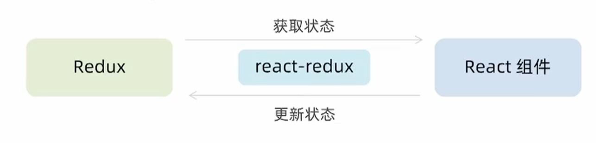

以下笔记内容参照黑马程序员的react18从入门到实战课程

## 概念

一个状态管理工具，相当于vue的pinia

## 使用步骤

与useReducer Hook相类似，都是通过dispatch函数和action状态来处理数据

1.定义reducer函数

2.使用reducer生成store实例

3.通过store实例的subscribe订阅数据变化

4.dispatch方法提交action对象，触发数据变化

5.使用store的getState方法获取最新的状态数据更新到视图中

## 环境准备

### 配套工具

#### redux Toolkit

官方推荐的编写redux逻辑的方式，是一套工具的集合集，简化书写方式

- 简化store的配置方式
- 内置immer支持可变式状态修改
- 内置thunk更好的异步创建

#### react-redux

用来链接Redux和React组件的中间件



### 启动项目

```bash
npx create-react-app react-redux
npm i @reduxjs/toolkit react-redux
npm run start
```

### 使用Redux

下面代码中counterReducer是正常的同步逻辑，channelReducer是包含异步逻辑的。代码几乎都是模板式，直接套用即可

#### 同步counterReducer

```javascript
// ./counterReducer
import { createSlice } from "@reduxjs/toolkit"

const counterStore = createSlice({
  name: 'counter',
  // 初始化state
  initialState: {
    count: 0
  },
  // 修改状态的方法 同步方法 支持直接修改
  reducers: {
    increment (state) {
      state.count++
    },
    decrement (state) {
      state.count--
    },
    addToNum (state, action) {
      state.count = action.payload
    }
  }
})

// 解构出来actionCreator函数
const { increment, decrement, addToNum } = counterStore.actions
// 获取reducer
const reducer = counterStore.reducer

// 以按需导出的方式导出actionCreator
export { increment, decrement, addToNum }
// 以默认导出的方式导出reducer
export default reducer


// Store./index.js
import { configureStore } from "@reduxjs/toolkit"
// 导入子模块reducer
import counterReducer from './modules/counterStore'

const store = configureStore({
  reducer: {
    counter: counterReducer,
    // 处理异步第三步
    channel: channelReducer
  }
})

export default store
```

#### 异步channelReducer

第一步：定义`actionCreator`(thunk函数)。创建一个**返回异步函数**的 action，这样你可以在里面做 `axios.get()` 请求，然后手动 `dispatch()` 同步的 `setChannels`

第二步：定义同步reducer方法setChannels，用于设置请求回来的数据到 state 中

第三步：在 store 中注册 channel reducer

第四步：在 React 项目中用 Provider 注入 store。让整个 React 应用都能访问到 Redux 中的 `store` 和状态

第五步：在组件中使用 `useDispatch` 派发异步 action。页面一加载就自动派发 `fetchChannelList()`，触发异步请求

第六步：请求完成后手动 `dispatch(setChannels(...))`。将请求成功拿到的数据，派发到同步的 `setChannels` 方法中，让 Redux 状态真正被更新

第七步：组件用 `useSelector` 读取状态，自动更新页面。组件订阅 Redux 状态，一旦 `channelList` 发生改变，组件自动重新渲染

```javascript
// channelReducer
import { createSlice } from "@reduxjs/toolkit"
import axios from "axios"

const channelStore = createSlice({
  name: 'channel',
  initialState: {
    channelList: []
  },
  reducers: {
    // 处理异步第二步
    setChannels (state, action) {
      state.channelList = action.payload
    }
  }
})

// 异步请求部分
const { setChannels } = channelStore.actions
// 处理异步第一步，fetchChannelList是一种特殊的action，它的返回函数是一个thunk函数，准们用来进行异步操作
const fetchChannelList = () => {
  return async (dispatch) => {
    const res = await axios.get('http://geek.itheima.net/v1_0/channels')
    dispatch(setChannels(res.data.data.channels))
  }
}

export { fetchChannelList }

const reducer = channelStore.reducer

export default reducer
```

### 为React注入Store

react-redux内置的Provider组件通过Store参数把创建好的store实例注入到应用中，链接正式成立

```javascript
// index.js
import React from 'react'
import ReactDOM from 'react-dom/client'
import './index.css'
import App from './App'
import reportWebVitals from './reportWebVitals'
import store from './store'
import { Provider } from 'react-redux'

const root = ReactDOM.createRoot(document.getElementById('root'))
root.render(
  <Provider store={store}>
    <App />
  </Provider>
)
```

在React组件中使用store中的数据，需要用到useSelector Hook，他的作用是把store中的数据映射到组件中

如果想要修改数据，则需要用过useDispatch Hook，生成提交action对象dispatch函数。在actionCreator中传递参数，这个参数会被传递到action的payload属性上

```javascript
import { useEffect } from 'react'
import { useDispatch, useSelector } from 'react-redux'
// 导入actionCreator
import { increment, decrement, addToNum } from './store/modules/counterStore'
import { fetchChannelList } from './store/modules/channelStore'
function App () {
  const { count } = useSelector(state => state.counter)
  const { channelList } = useSelector(state => state.channel)
  const dispatch = useDispatch()
  // 使用useEffect触发异步请求执行
  useEffect(() => {
    dispatch(fetchChannelList())
  }, [dispatch])
  return (
    <div className="App">
      <button onClick={() => dispatch(decrement())}>-</button>
      {count}
      <button onClick={() => dispatch(increment())}>+</button>
       
      <ul>
        {
        	channelList.map(item => <li key={item.id}>{item.name}</li>)
				}
      </ul>
    </div>
  )
}
```

通俗点记忆就是useSelector获取数据，useDispatch关联修改数据的方法


