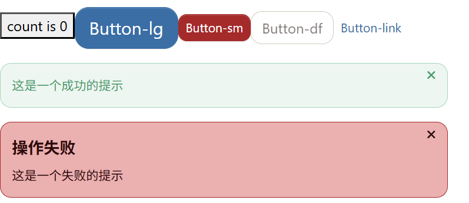
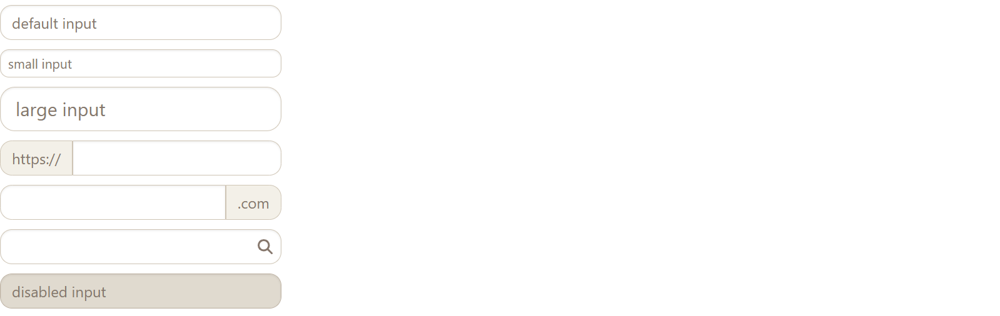
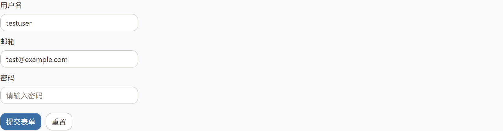

一些碎碎念

作为我第一个完成的完整的React项目，在正式部署上线在npm之后真的松了好大一口气，也是自己努力的见证，真的真的很开心。不得不说，写项目相比学新的东西相比真的十分的枯燥，但是能很好巩固好自己的知识点，以及加强对各种工具的运用，刚开始写的时候我连git push都不知道怎么操作哈哈哈哈哈，现在真的是熟练的可怜(被这个github actions整破防了属于是，好吧它帅，无罪)。

第一次写code view，不知道怎么下笔啊TvT，就从写每个步骤的心得来吧。一直在写个什么样的项目比较好，思来想去，就是市面上普遍的管理系统用React实现一遍，写了个像模像样的，但是还是觉得一般般。后来又看到Vue仿Element的项目，我就想到了仿照Ant design写一个UI组件库。其实还有在考虑前端埋点监控，因为听说这是字节青训营的一个项目，查阅了些资料感觉对于刚刚学会React的鼠鼠来说，好像有点难难的TvT，等技术再精进一点的时候再去看看(这里里一个flag)。好废话不多说，开始！

**技术栈**

React + TypeScript + Vite + Scss + Vitest + Storybook + ESLint + Github Actions

# 组件主体部分

在Form之前写组件的都没怎么注意渲染之类的性能问题，所以示例都是普通的定义函数之类的，我等写完这篇文章之后再进行进一步的性能优化

## Button&Alert

下面是演示，最左边的是原生的button



这里是实现一个组件的基本框架结构

```typescript
// 引入需要的东西
import React form 'react'
import ...

// 定义类型
export type ButtonType = 'primary' | 'default' | 'danger' | 'link'
export interface ButtonProps {
  className: string
  btnType: ButtonType
  size: 'lg' | 'sm'
  children: React.ReactNode
  ...
}
  
// 实现组件主逻辑
const Button: React.FC<ButtonProps> = (props) => {
    // 一些参数
    const { className, btnType, size, children, ...restProps } = props
    const classes = classNames('btn', className, {
        [`btn-${btnType}`]: btnType,
        ...
    })
    // 也可以有一些实现事件的代码逻辑
    // ...
		
    // 返回值
    if (btnType === 'link' && href) {
        return (
        ...
        )
    } else {
        return (
        <button className={classes} disabled={disabled} {...restProps}>
            {children}
        </button>
        )
    }
}
// 默认导出
export default Button
```

之后写组件的整体框架都如上，迈出第一步很困难，但完成之后回看会发现怎么这么简单哈哈哈哈。

Button和Alert是最基础的组件，稍微有点点要逻辑的地方就是点击的交互事件

## Menu&Tabs

以Menu组件为例，组成部分有Menu，MenuItem，subMenu。整体采用 Context 模式实现组件间状态共享，确保了高内聚低耦合的组件架构和良好的用户体验

展示


实现功能

使用React.children.map+React.cloneElement支持多个子组件

使用不同的交互逻辑实现水平垂直两个模式

通过onSelect函数+Context回调实现点击交互功能

使用useState+Context实现激活状态管理

结合了Transition组件增加平滑的动画增加用户的交互体验

技术难点

1.子组件的类型检查和索引分配

```typescript
const renderChildren = () => {
  return React.Children.map(children, (child, index) => {
    // 使用泛型确保类型正确
    const childElement = child as React.ReactElement<MenuItemProps, typeof MenuItem>
      const { displayName } = childElement.type
    // 通过displayName识别组件类型
    if (displayName === 'MenuItem' || displayName === 'SubMenu') {
      // React.cloneElement动态添加index属性
      return React.cloneElement(childElement, { index: index.toString() })
    } else {
      console.error('Warning: Menu has a child which is not a MenuItem component')
      return null
    }
  })
}
```

2.多级索引设计，以确保每个菜单都有唯一标识且有层次

```typescript
const childrenComponents = React.Children.map(children, (child, i) => {
  const childElement = child as React.ReactElement<MenuItemProps>
  const { displayName } = childElement.type as any
  if (displayName === 'MenuItem') {
    // 生成复合索引: 父索引-子索引
    return React.cloneElement(childElement, { index: `${index}-${i}` })
  }
})
```

3.不同模式下的交互逻辑分离

```typescript
// 条件性事件绑定
const clickEvents = context.mode === 'vertical' ? { onClick: handlerClick } : {}

const hoverEvents = context.mode === 'horizontal' 
  ? {
      onMouseEnter: (e: React.MouseEvent) => handlerMouse(e, true),
      onMouseLeave: (e: React.MouseEvent) => handlerMouse(e, false),
    }
  : {}

// 悬停延迟处理
const handlerMouse = (e: React.MouseEvent, toggle: boolean) => {
  if (timer.current) clearTimeout(timer.current)
  e.preventDefault()
  timer.current = setTimeout(() => {
    setIsOpen(toggle)
  }, 200)  // 200ms 延迟
}
```

4.点击外部关闭功能

```typescript
// 使用自定义 Hook 处理点击外部
const subMenuRef = useRef<HTMLLIElement>(null)
useClickOutside(subMenuRef, () => setIsOpen(false))

// useClickOutside Hook 实现
function useClickOutside(ref: RefObject<HTMLElement | null>, callback: (event: MouseEvent) => void) {
  useEffect(() => {
    const listener = (event: MouseEvent) => {
      if (!ref.current || ref.current.contains(event.target as HTMLElement)) {
        return
      }
      callback(event)
    }
    document.addEventListener('click', listener)
    return () => {
      document.removeEventListener('click', listener)
    }
  }, [ref, callback])
}
```

## Icon

实现功能

使用FontAwesome图标库，支持丰富的图标资源

支持8种主题颜色(primary secondary success danger warning info light dark)，也可以动态生成主题样式的类

继承透传 FontAwesome 的所有属性，保持 API 一致性

```typescript
export interface IconProps extends FontAwesomeIconProps {
  theme?: themeType
  className?: string
  style?: React.CSSProperties
}

return <FontAwesomeIcon className={classes} style={style} {...resetProps} />
```

使用 SCSS 循环自动生成主题样式

```scss
@each $key, $value in $theme-colors {
  .icon-#{$key} {
    color: $value;
  }
}
```

技术难点

1.第三方库集成

```typescript
// 如何优雅地集成 FontAwesome 并保持 API 一致性
export interface IconProps extends FontAwesomeIconProps {
  theme?: themeType  // 扩展主题属性
  className?: string
  style?: React.CSSProperties
}

// 解决方案：继承 FontAwesome 属性，透传所有原生功能
const Icon: React.FC<IconProps> = (props) => {
  const { className, theme, style, ...resetProps } = props
  return <FontAwesomeIcon className={classes} style={style} {...resetProps} />
}
```

2.icon props的引入

```typescript
import { library } from '@fortawesome/fontawesome-svg-core'
library.add(fas, faR, faSpinner)
```

## Transition

碎碎念： 初衷是用CSSTransition写的，但是自定义Transition更有利于锻炼自己对React Hooks的使用，虽然没有那么成熟，但是更轻量，更定制化(纯纯夸自己)。

展示

展示不了，事实证明markdown不能上传视频TvT

实现功能

1.使用useState管理动画状态

```typescript
const [isVisible, setIsVisible] = useState(inProp)  // 控制 DOM 显示/隐藏
const [status, setStatus] = useState<AnimationStatus>(inProp ? 'enter' : 'exit')  // 控制动画状态
```

2.使用useEffect控制动画生命周期

3.动画类型系统(zoom-in -top,zoom-in-button......)

4.有自定义标签(能渲染成任意的HTML标签)和包装器(防止样式冲突)

技术难点

1.动画时序控制

```typescript
useEffect(() => {
  let enterTimer: number | undefined
  let doneTimer: number | undefined
  if (inProp) {
    // 进入动画流程
    setIsVisible(true)        // 1. 立即显示元素
    setStatus('enter')        // 2. 设置准备进入状态
    onEnter?.()              // 3. 调用进入回调  
    // 4. 延迟设置激活状态，确保浏览器渲染 enter 状态
    doneTimer = window.setTimeout(() => {
      setStatus('enter-active')  // 5. 开始进入动画
      onEntered?.()             // 6. 调用进入完成回调
    }, timeout)
  } else if (isVisible) {
    // 退出动画流程
    setStatus('exit')         // 1. 设置准备退出状态
    onExit?.()               // 2. 调用退出回调
    setStatus('exit-active')  // 3. 开始退出动画
    // 4. 延迟隐藏元素
    doneTimer = window.setTimeout(() => {
      setIsVisible(false)     // 5. 隐藏元素
      onExited?.()           // 6. 调用退出完成回调
    }, timeout)
  }
  // 清理定时器防止内存泄漏
  return () => {
    if (enterTimer) clearTimeout(enterTimer)
    if (doneTimer) clearTimeout(doneTimer)
  }
}, [inProp, isVisible, timeout, onEnter, onEntered, onExit, onExited])
```

2.状态同步问题，isVisible和Status需要保持状态一致，使用useEffect统一管理状态

```typescript
const [isVisible, setIsVisible] = useState(inProp)
const [status, setStatus] = useState<AnimationStatus>(inProp ? 'enter' : 'exit')
useEffect(() => {
  if (inProp) {
    // 进入时：先显示，再设置状态
    setIsVisible(true)
    setStatus('enter')
    // ... 后续状态变化
  } else if (isVisible) {
    // 退出时：先设置状态，再隐藏
    setStatus('exit')
    // ... 
  }
}, [inProp, isVisible, timeout, onEnter, onEntered, onExit, onExited])
```

3.定时器可能导致内存泄漏，需要在组件卸载时清理

```typescript
useEffect(() => {
  let doneTimer: number | undefined
  if (inProp) {
    // ...
    // 使用变量存储定时器 ID
    doneTimer = window.setTimeout(() => {
      setStatus('enter-active')
      onEntered?.()
    }, timeout)
  } else if (isVisible) {
    // ...
    // 使用变量存储定时器 ID
    doneTimer = window.setTimeout(() => {
      setIsVisible(false)
      onExited?.()
    }, timeout)
  }
  // 组件卸载时清理所有定时器
  return () => {
    if (doneTimer) clearTimeout(doneTimer)
  }
}, [inProp, isVisible, timeout, onEnter, onEntered, onExit, onExited])
```

4.被包裹的组件可能有自身的 transition 样式，导致动画冲突

```typescript
const Transition: React.FC<TransitionProps> = (props) => {
  const {
    // ... 
    wrapper,  // 包装器属性
    ...restProps
  } = props
  // 条件渲染：根据 wrapper 属性决定是否包装
  const Tag = tag as ElementType
  return (
    <Tag className={`${classNames} ${animation}-${status}`} {...restProps}>
      {wrapper ? <div>{children}</div> : children}
    </Tag>
  )
}

// 使用示例
<Transition 
  in={isOpen} 
  wrapper={true}  // 启用包装器，避免样式冲突
>
  <ul className="menu-list">  // 子组件的 transition 样式被包装器隔离
    <li>菜单项</li>
  </ul>
</Transition>
```

## Input

展示



实现功能

1.使用forwardRef支持ref转发，能控制受控组件的value

2.属性继承原生inputElement属性，同时使用Omit排除部分原有的属性

3.支持前缀、图标、输入框、后缀的组合布局

技术难点

1.处理受控组件的值，避免 undefined/null 导致的 React 警告

```typescript
const fixControlledValue = (value: any) => {
  if (typeof value === 'undefined' || value === null) {
    return ''  // 转换为空字符串
  }
  return value
}

// 在受控模式下应用值处理
if ('value' in props) {
  delete restProps.defaultValue  // 删除默认值避免冲突
  restProps.value = fixControlledValue(props.value)  // 使用处理后的值
}
```

2.原生 input 的 size 属性与自定义 size 属性冲突

```typescript
export interface InputProps extends Omit<InputHTMLAttributes<HTMLElement>, 'size'> {
  size?: string  // 自定义尺寸属性
}
// 使用 Omit 排除原生 size 属性
// Omit<InputHTMLAttributes<HTMLElement>, 'size'> 排除 size 属性
// 然后定义自定义的 size 属性
```

3.前缀、后缀、图标的条件渲染，避免渲染空元素

```typescript
// 正确的条件渲染
{prepend && <div className="jasmine-input-group-prepend">{prepend}</div>}
{icon && (
  <div className="icon-wrapper">
    <Icon icon={icon} title={`title-${icon}`} />
  </div>
)}
{append && <div className="jasmine-input-group-append">{append}</div>}

// 使用 && 操作符进行条件渲染
// 只有当条件为真时才渲染元素
```

4.使用 forwardRef 正确转发 ref 到原生 input 元素

```typescript
const Input = forwardRef<HTMLInputElement, InputProps>((props, ref) => {
  const { size, append, prepend, disabled, icon, style, ...restProps } = props
  
  // 处理受控组件逻辑...
  
  return (
    <div className={className} style={style}>
      {prepend && <div className="jasmine-input-group-prepend">{prepend}</div>}
      {icon && (
        <div className="icon-wrapper">
          <Icon icon={icon} title={`title-${icon}`} />
        </div>
      )}
      <input ref={ref} className="jasmine-input-inner" disabled={disabled} {...restProps} />
      {append && <div className="jasmine-input-group-append">{append}</div>}
    </div>
  )
})
```

## Autocomplete

## Upload

实现功能

1.使用自定义type和useState实现文件状态管理系统

2.异步上传：处理 beforeUpload 的同步和异步返回值

3.实现了拖拽上传文件的功能

4.可以根据文件状态显示不同的图标和进度

5.使用Date.now()使每个文件都有唯一标识，避免状态更新冲突

6.增加了可以复用的进度条组件Progress用来配合Upload，这里就不多做详解了

技术难点

1.多个文件同时上传时，需要精确更新特定文件的状态，避免状态混乱

```typescript
const updateFileList = (updateFile: UploadFile, updateObj: Partial<UploadFile>) => {
  setFileList((prevList) => {
    return prevList.map((file) => {
      if (file.uid === updateFile.uid) {  // 使用唯一ID匹配
        return { ...file, ...updateObj }  // 合并更新对象
      } else {
        return file  // 保持其他文件不变
      }
    })
  })
}

// 使用示例
updateFileList(_file, { percent: 50, status: 'uploading' })
updateFileList(_file, { status: 'success', response: res.data })
```

2.beforeUpload 钩子可能返回 Promise，需要处理同步和异步两种情况

```typescript
const uploadFiles = (files: FileList) => {
  const postFiles = Array.from(files)
  postFiles.forEach((file) => {
    if (!beforeUpload) {
      post(file)  // 没有验证函数，直接上传
    } else {
      const result = beforeUpload(file)
      if (result && result instanceof Promise) {
        // 异步处理：返回 Promise
        result.then((processFile) => {
          post(processFile)  // 使用处理后的文件
        }).catch((error) => {
          console.error('验证失败:', error)
        })
      } else if (result !== false) {
        // 同步处理：返回非 false 值
        post(file)
      }
      // result === false 时不上传
    }
  })
}
```

3.正确处理拖拽事件，避免默认行为，获取文件并触发上传

```typescript
const Dragger: React.FC<DraggerProps> = ({ onFile, children }) => {
  const [dragOver, setDragOver] = useState(false)
  const handleDragOver = (e: DragEvent<HTMLDivElement>) => {
    e.preventDefault()  // 阻止默认行为
    e.dataTransfer.dropEffect = 'copy'  // 设置拖拽效果
    setDragOver(true)  // 更新拖拽状态
  }
  const handleDragLeave = (e: DragEvent<HTMLDivElement>) => {
    e.preventDefault()
    setDragOver(false)  // 重置拖拽状态
  }
  const handleDrop = (e: DragEvent<HTMLDivElement>) => {
    e.preventDefault()  // 阻止默认行为
    setDragOver(false)  // 重置拖拽状态
    const files = e.dataTransfer.files  // 获取文件列表
    if (files && files.length > 0) {
      onFile(files)  // 触发文件上传
    }
  }
  return (
    <div
      className={classes}
      onDragOver={handleDragOver}
      onDragLeave={handleDragLeave}
      onDrop={handleDrop}
    >
      {children || <span>拖拽文件到此上传</span>}
    </div>
  )
}
```

：其实感觉这里还要再优化一下，仅仅拖拽一个文件的时候拖拽完上传文件的窗口没有自己关闭，这个功能似乎能实现？将拖拽事件和点击事件分开

4.实时更新上传进度，避免频繁重渲染影响性能

```typescript
onUploadProgress: (e) => {
  if (!e.total) return  // 避免除零错误
  const percentage = Math.round((e.loaded * 100) / e.total)
  if (percentage < 100) {
    // 只在进度小于100%时更新
    updateFileList(_file, { 
      percent: percentage, 
      status: 'uploading' 
    })
    onProgress?.(percentage, file)  // 触发外部回调
  }
  // 100%时由成功/失败回调处理
}
```

：这里也能优化，每获取一次percentage就重新渲染太浪费资源了。当时上传了一个10mb+的图片，控制台console.log了无数次。。。就放在最后的性能优化上面吧(希望的是减少渲染次数的同时保证进度条的流畅性，目前想到的方案是CSS动画 + 节能）。

5.处理上传失败，提供重试机制和错误信息展示

```typescript
axios.post(action, formData, {
  headers: { ...header, 'Content-Type': 'multipart/form-data' },
  withCredentials,
  onUploadProgress: (e) => {
    // 进度处理...
  },
})
.then((res) => {
  // 成功处理
  updateFileList(_file, { 
    status: 'success', 
    response: res.data 
  })
  onSuccess?.(res.data, file)
  onChange?.(file)
})
.catch((err) => {
  // 错误处理
  updateFileList(_file, { 
    status: 'error', 
    error: err 
  })
  onError?.(err, file)
  onChange?.(file)
})

// 在 UploadList 中显示错误状态
{item.status === 'error' && (
  <div className="error-info">
    <Icon icon="times-circle" theme="danger" />
    <span>上传失败</span>
    <button onClick={() => retryUpload(item)}>重试</button>
  </div>
)}
```

## Form

到最后的Form组件啦，算是耗时最久的一个组件，也是最先进行性能优化的组件，所以看着更高级一点嗯嗯对

展示



实现功能

1.使用 useReducer 实现状态管理系统

2.使用 async-validator 实现表单验证功能

3.受控组件管理：FormItem 自动为子组件注入受控属性，再用cloneElement混合属性

4.通过 Context 在组件树中共享状态，Form组件提供Context，FormItem消费Context

技术难点

1.让任意子组件自动变成受控组件，无需手动传递 value/onChange

```typescript
const FormItem: FC<FormItemProps> = (props) => {
  const { name, valuePropName = 'value', trigger = 'onChange' } = props
  const { dispatch, fields } = useContext(FormContext)
  // 获取当前字段值
  const value = fields[name]?.value ?? initialValues?.[name] ?? getDefaultValue(valuePropName)
  // 值更新处理
  const onValueUpdate = (e: any) => {
    const value = getValueFromEvent(e)
    dispatch({ type: 'onValueUpdate', name, value })
  }
  // 构建受控属性
  const controlProps: Record<string, any> = {}
  controlProps[valuePropName] = value      // 注入 value
  controlProps[trigger] = onValueUpdate    // 注入 onChange
  // 使用 cloneElement 自动注入属性
  const returnChildNode = React.isValidElement(child)
    ? React.cloneElement(child as React.ReactElement, controlProps)
    : child
    
  return <div>{returnChildNode}</div>
}
```

2.支持函数式验证规则，规则可以依赖其他字段的值

```typescript
export type CustomRuleFunction = ({ getFieldValue }: { getFieldValue: (name: string) => any }) => RuleItem
export type CustomRule = RuleItem | CustomRuleFunction
// 规则转换函数
const transformRules = useCallback((rules: CustomRule[]) => {
  return rules.map(rule => {
    if (typeof rule === 'function') {
      // 函数式规则：传入 getFieldValue 函数
      const calledRule = rule({ getFieldValue })
      return calledRule
    } else {
      // 静态规则：直接返回
      return rule
    }
  })
}, [getFieldValue])

// 使用示例
const rules = [
  { required: true, message: '密码不能为空' },
  { min: 6, message: '密码至少6位' },
  // 函数式规则：确认密码必须与密码一致
  ({ getFieldValue }) => ({
    validator: (rule, value) => {
      const password = getFieldValue('password')
      if (value !== password) {
        return Promise.reject('两次密码输入不一致')
      }
      return Promise.resolve()
    }
  })
]
```

3.使用useRenducer+useMemo优化状态更新性能，避免频繁重渲染

```typescript
// 使用 useReducer 管理状态
const [fields, dispatch] = useReducer(fieldsReducer, {})

// 状态更新 reducer
function fieldsReducer(state: FieldState, action: FieldAction): FieldState {
  switch (action.type) {
    case 'onValueUpdate':
      return {
        ...state,
        [action.name]: {
          ...state[action.name],  // 只更新特定字段
          value: action.value,
        },
      }
    case 'updateValidateResult':
      return {
        ...state,
        [action.name]: {
          ...state[action.name],
          isValid: action.value.isValid,
          errors: action.value.errors,
        },
      }
    default:
      return state
  }
}

// 使用 useMemo 优化 Context 值
const passedContext = useMemo(() => ({
  dispatch,
  fields, 
  initialValues, 
  validateField
}), [dispatch, fields, initialValues, validateField])
```

4.try-catch处理异步验证，避免竞态条件，提供良好的用户体验

```typescript
const validateField = async (name: string) => {
  const { value, rules } = fields[name]
  const afterRules = transformRules(rules)
  const descriptor = { [name]: afterRules }
  const valueMap = { [name]: value }
  const validator = new Schema(descriptor)
  let isValid = true
  let errors: ValidateError[] = []
  try {
    await validator.validate(valueMap)
  } catch (e) {
    isValid = false
    const err = e as any
    errors = err.errors || []
  } finally {
    // 无论成功失败都更新状态
    dispatch({ type: 'updateValidateResult', name, value: { isValid, errors } })
  }
}

// 全表单验证
const validateAllFields = useCallback(async () => {
  setForm(prev => ({ ...prev, isSubmitting: true }))
  let isValid = true
  let errors: Record<string, ValidateError[]> = {}
  // 构建所有字段的验证描述符
  const valueMap = mapValues(fields, field => field.value)
  const descriptor = mapValues(fields, field => transformRules(field.rules))
  const validator = new Schema(descriptor)
  try {
    await validator.validate(valueMap)
  } catch (e) {
    isValid = false
    const err = e as ValidateErrorType
    errors = err.fields || {}
  }
  // 更新所有字段的验证状态
  each(fields, (value, name) => {
    if (errors[name]) {
      const itemErrors = errors[name]
      dispatch({ type: 'updateValidateResult', name, value: { isValid: false, errors: itemErrors } })
    } else if (value.rules.length > 0 && !errors[name]) {
      dispatch({ type: 'updateValidateResult', name, value: { isValid: true, errors: [] } })
    }
  })
  
  setForm(prev => ({ ...prev, isSubmitting: false, isValid, errors }))
  return { isValid, errors, values: valueMap }
}, [fields, transformRules, dispatch])
```

# Test

为了保证代码质量，提升开发效率，以及增强可维护性，在项目中添加了测试文件。

测试框架是Vitest + React Testing Library，组件覆盖度是90%，对每个组件的核心功能都做了测试，也尝试了不同的方法去验证。写测试代码难度比较大的有Transition，Upload，Form，再说清楚写测试文件的基本框架之后，开始一一做解释。

## 测试基本框架

```typescript
// 1. 导入依赖
import { render, fireEvent, screen, waitFor } from '@testing-library/react'
import { test, expect, describe, vi, beforeEach } from 'vitest'
import Component from './Component'
import type { ComponentProps } from './Component'

// 2. Mock 外部依赖（如需要）
vi.mock('axios', () => ({
  default: {
    post: vi.fn(() => Promise.resolve({ data: 'success' })),
  },
}))

// 3. 定义测试数据
const defaultProps: ComponentProps = {
  // 默认属性
}

const testProps: ComponentProps = {
  // 测试属性
}

// 4. 核心代码
describe('Component 组件测试', () => {
  beforeEach(() => {
    vi.clearAllMocks() // 清理 mock
  })

  // 5. 基础渲染测试
  test('应该正确渲染默认的 Component', () => {
    render(<Component {...defaultProps} />)
    expect(screen.getByText('Expected Text')).toBeInTheDocument()
  })

  // 6. 属性测试
  test('应该根据不同的 props 渲染不同的样式', () => {
    // 测试不同属性
  })

  // 7. 交互测试
  test('点击应该触发回调', () => {
    const mockCallback = vi.fn()
    render(<Component {...defaultProps} onClick={mockCallback} />)
    fireEvent.click(screen.getByRole('button'))
    expect(mockCallback).toHaveBeenCalled()
  })

  // 8. 异步测试
  test('异步操作应该正确处理', async () => {
    render(<Component {...defaultProps} />)
    await waitFor(() => {
      expect(screen.getByText('Async Content')).toBeInTheDocument()
    })
  })
})
```

## Transition

主要难点是测试 CSS 动画和生命周期钩子

核心代码

```typescript
describe('Transition 组件测试', () => {
  test('应该正确处理退出动画的生命周期钩子', async () => {
    const onExitMock = vi.fn()
    const onExitedMock = vi.fn()
    // 先渲染为 true，然后变为 false 来触发退出动画
    const { rerender } = render(
      <Transition {...defaultProps} in={true} onExit={onExitMock} onExited={onExitedMock} />
    )
    // 变为 false 触发退出动画
    rerender(
      <Transition {...defaultProps} in={false} onExit={onExitMock} onExited={onExitedMock} />
    )
    // 等待防抖完成和退出动画触发
    await waitFor(() => {
      expect(onExitMock).toHaveBeenCalled()
    }, { timeout: 100 })
    await waitFor(() => {
      expect(onExitedMock).toHaveBeenCalled()
    }, { timeout: 500 })
  })

  test('应该正确处理自定义超时时间', async () => {
    const onEnteredMock = vi.fn()
    render(
      <Transition 
        {...defaultProps} 
        timeout={1000} 
        onEntered={onEnteredMock} 
      />
    )  
    // 等待自定义超时时间
    await waitFor(() => {
      expect(onEnteredMock).toHaveBeenCalled()
    }, { timeout: 1100 })
  })
})
```

## Upload

主要难点是测试文件上传、拖拽、异步操作

```typescript
// 在测试环境中不能发送真实的 HTTP 请求，所以要用mock来模拟真正的返回值
vi.mock('axios', () => ({
  default: {
    post: vi.fn(() => Promise.resolve({ data: 'success' })),
  },
}))

describe('Upload 组件测试', () => {
  const mockFile = new File(['test content'], 'test.txt', { type: 'text/plain' })
  test('应该正确处理文件选择', async () => {
    const onChangeMock = vi.fn()
    render(<Upload {...defaultProps} onChange={onChangeMock} />)

    const input = document.querySelector('input[type="file"]')
    expect(input).toBeInTheDocument()
    
    if (input) {
      fireEvent.change(input, { target: { files: [mockFile] } })
      await waitFor(() => {
        expect(onChangeMock).toHaveBeenCalled()
      })
    }
  })
  
  test('应该正确处理拖拽上传', async () => {
    const onChangeMock = vi.fn()
    const onSuccessMock = vi.fn()
    const dragProps: UploadProps = {
      action: 'https://jsonplaceholder.typicode.com/posts',
      drag: true,
      onChange: onChangeMock,
      onSuccess: onSuccessMock,
    }
    render(<Upload {...dragProps} />)
    // 查找拖拽区域
    const dragger = screen.getByText('拖拽文件到此上传')
    expect(dragger).toBeInTheDocument()
    // 创建模拟的 dataTransfer 对象
    const mockDataTransfer = {
      files: [mockFile],
      dropEffect: 'copy',
      setData: vi.fn(),
      getData: vi.fn(),
    }
    // 模拟拖拽过程
    fireEvent.dragOver(dragger, { dataTransfer: mockDataTransfer })
    fireEvent.drop(dragger, { dataTransfer: mockDataTransfer })
    // 验证上传成功
    await waitFor(() => {
      expect(onChangeMock).toHaveBeenCalled()
    })
    await waitFor(() => {
      expect(onSuccessMock).toHaveBeenCalledWith('success', mockFile)
    })
  })

  test('当 beforeUpload 返回 false 时应该阻止上传', async () => {
    const beforeUploadMock = vi.fn().mockReturnValue(false)
    const onChangeMock = vi.fn()
    render(<Upload {...testProps} beforeUpload={beforeUploadMock} onChange={onChangeMock} />)
    const input = document.querySelector('input[type="file"]')
    if (input) {
      fireEvent.change(input, { target: { files: [mockFile] } })
      await waitFor(() => {
        expect(beforeUploadMock).toHaveBeenCalledWith(mockFile)
        expect(onChangeMock).not.toHaveBeenCalled()
      })
    }
  })
})
```

## Form

难点：测试表单验证、状态管理、Context 共享

```typescript
describe('Form 组件测试', () => {
  test('应该正确处理 onFinish 回调', async () => {
    const onFinishMock = vi.fn()
    render(
      <Form {...testProps} onFinish={onFinishMock}>
        <FormItem name="username" label="用户名">
          <Input placeholder="请输入用户名" />
        </FormItem>
        <button type="submit">提交</button>
      </Form>
    )
    
    const submitButton = screen.getByText('提交')
    fireEvent.click(submitButton)
    
    await waitFor(() => {
      expect(onFinishMock).toHaveBeenCalled()
    })
  })

  test('应该正确处理 onFinishFailed 回调', async () => {
    const onFinishFailedMock = vi.fn()
    render(
      <Form {...testProps} onFinishFailed={onFinishFailedMock}>
        <FormItem 
          name="username" 
          label="用户名"
          rules={[{ required: true, message: '用户名不能为空' }]}
        >
          <Input placeholder="请输入用户名" />
        </FormItem>
        <button type="submit">提交</button>
      </Form>
    )
    
    const submitButton = screen.getByText('提交')
    fireEvent.click(submitButton)
    
    await waitFor(() => {
      expect(onFinishFailedMock).toHaveBeenCalled()
    })
  })
})
```

# Storybook部分

storybook是一个用于独立开发和测试UI的工具，能很明确的通过各个story中展示、测试自己写的组件，支持自定义，也支持自动生成(我比较懒我直接自动生成了哈哈哈哈)。似乎很多组件库的文档都是用storybook展示。我自己写的storybook感觉还是比较潦草emmm。没事的。

成果可以去这里查看：https://jasmine661.github.io/jasmine-ui/

基本框架

```typescript
// 以Button.stories.tsx为例
import type { Meta, StoryObj } from '@storybook/react'
import { Button } from './Button'

// 1. Meta 配置
const meta: Meta<typeof Button> = {
  title: 'Example/Button',           // 在侧边栏中的位置
  component: Button,                 // 要展示的组件
  parameters: {                      // 全局配置
    layout: 'centered',              // 布局方式
    docs: {
      description: {
        component: '这是一个按钮组件的描述'
      }
    }
  },
  tags: ['autodocs'],                // 自动生成文档
  argTypes: {                        // 参数类型定义
    backgroundColor: { control: 'color' },
    size: {
      control: { type: 'select' },
      options: ['small', 'medium', 'large']
    }
  }
}
export default meta
type Story = StoryObj<typeof meta>
// 2. 基础 Story
export const Primary: Story = {
  args: {
    primary: true,
    label: 'Button',
  },
}
// 3. 自定义渲染的 Story
export const CustomRender: Story = {
  render: (args) => (
    <div style={{ padding: '20px' }}>
      <Button {...args} />
    </div>
  ),
  args: {
    label: 'Custom Button',
  },
}
```

一个简单的story能用到的各种参数设置基本就在这里啦，更具体的可以去看看文档，基本是边查文档边写的

让我比较满意的几个story如下

1.首先就是AutoComplete的一个集成了真实API的story，用于搜索github上用户的API

```typescript
const fetchGitHubUsers = async (query: string): Promise<DataSourceType<GitHubUser>[]> => {
  if (!query) return []
  const res = await fetch(`https://api.github.com/search/users?q=${query}`)
  const data = await res.json()
  return data.items.slice(0, 10).map((item: any) => ({
    value: item.login,
    html_url: item.html_url,
    avatar_url: item.avatar_url,
  }))
}

export const GitHubUsers: GitHubStory = {
  args: {
    placeholder: '输入 GitHub 用户名',
    fetchSuggestions: fetchGitHubUsers,
    renderOption: (item: DataSourceType<GitHubUser>) => (
      <div style={{ display: 'flex', alignItems: 'center', gap: '0.5rem' }}>
        
        <span>{item.value}</span>
      </div>
    ),
  },
}
```

2.From的story展示了复杂的自定义验证规则和异步验证

```typescript
const confirmRule: CustomRule[] = [
  { type: 'string', required: true, min: 3, max: 8 },
  ({ getFieldValue }) => ({
    asyncValidator: (_, value) => {
      return new Promise((resolve, reject) => {
        if (value !== getFieldValue('password')) {
          reject('The two passwords that you entered do not match!')
        }
        setTimeout(() => {
          resolve()
        }, 1000)
      })
    }
  })
]
```

总的来说，感觉storybook会看文档弄懂参数就好了，很简单就能理解并举一反三

# 打包部分

## 使用的工具

Vite + TypeScript + pnpm + Scss + ESLint + Prettier + Hasky + Vitest + Storybook + @testing-library/react

好的看着真高大上啊

## 步骤

### 优化配置文件

```typescript
// vite.config.ts
build: {
  lib: {
    entry: resolve(dirname, 'src/index.tsx'),
    name: 'JasmineUI',
    fileName: (format) => `jasmine-ui.${format}.js`
  },
  rollupOptions: {
    external: ['react', 'react-dom'], // 外部化依赖，减少包体积
    output: {
      globals: {
        react: 'React',
        'react-dom': 'ReactDOM'
      }
    }
  }
}
```
在package.json中将storybook，test，ESlint等配置放在devDependencies中

```json
"dependencies": {
    "@fortawesome/fontawesome-svg-core": "^6.7.2",
    "@fortawesome/free-solid-svg-icons": "^6.7.2",
    "@fortawesome/react-fontawesome": "^0.2.2",
    "async-validator": "^4.2.5",
    "axios": "^1.10.0",
    "classnames": "^2.5.1",
    "jasmine661-ui": "link:",
    "lodash-es": "^4.17.21",
    "normalize.css": "^8.0.1",
    "react-transition-group": "^4.4.5"
  },
```

配置jasmine-ui专属eslint：eslint-config-jasmine-ui.js

```javascript
import js from '@eslint/js'
import globals from 'globals'
import reactHooks from 'eslint-plugin-react-hooks'
import reactRefresh from 'eslint-plugin-react-refresh'
import tseslint from 'typescript-eslint'

export default tseslint.config(
  { ignores: ['dist', 'node_modules', 'build'] },
  {
    extends: [js.configs.recommended, ...tseslint.configs.recommended],
    files: ['**/*.{ts,tsx,js,jsx}'],
    languageOptions: {
      ecmaVersion: 2020,
      globals: {
        ...globals.browser,
        ...globals.node,
      },
    },
    plugins: {
      'react-hooks': reactHooks,
      'react-refresh': reactRefresh,
    },
    rules: {
      ...reactHooks.configs.recommended.rules,
      'react-refresh/only-export-components': ['warn', { allowConstantExport: true }],
      '@typescript-eslint/no-explicit-any': 'warn',
      '@typescript-eslint/no-unused-vars': 'warn',
      'no-console': 'warn',
      'prefer-const': 'error',
    },
  }
)
```

### 添加storybook静态文档

### 使用GitHub Actions配置CI/CD


