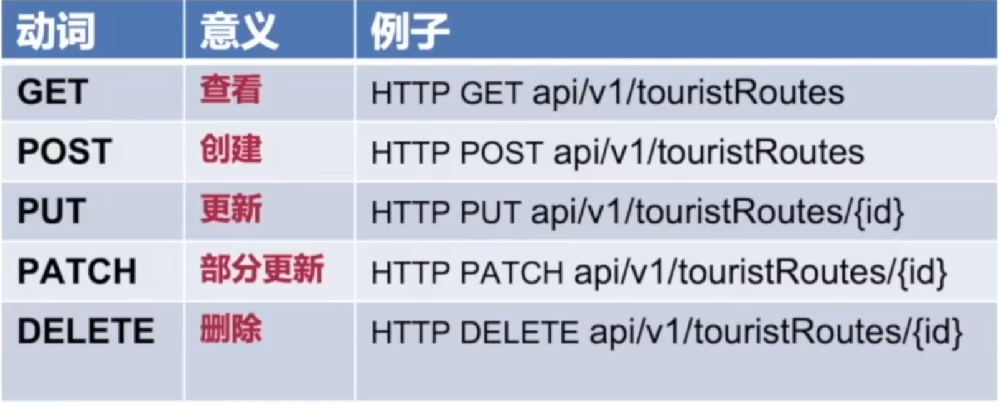

# 概念

RESTful 是一种 Web API 设计风格，它强调使用 HTTP 的标准方法（GET、POST、PUT、DELETE）来对资源进行操作。是一种 **非常经典的 API 设计规范**，目前仍然是企业开发中主流的接口风格，尤其适合后台管理、内容管理等系统。

# 基本特点

1.无状态

2.面向资源

3.使用HTTP动词

4.HATOAS超媒体即应用状态引擎

# 优缺点

在设计面向对象的API时很方便好用，但是在面向过程的时候不好用，既是规范，也是限制。但是RESTful仅仅是一个规范，是为了帮助我们更好的编程，而不用刻意去迎合它。

# 最后

本鼠鼠还仅仅掌握了前端相关知识，对于API之类的东西不用太深入了解，知道概念就好啦~