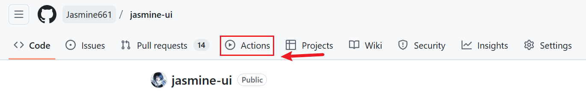

**参考文章**

[从零开始学 GitHub Actions：用自动化提升开发效率作为一名正在努力提升自己的程序员，我最近发现 GitHub - 掘金](https://juejin.cn/post/7527666903786668041?searchId=202509141107594379248D30829B4B88F6)

https://docs.github.com/zh/actions/get-started/quickstart

# 概念

- CI/CD(持续集成/持续部署)，能将重复的开发工作自动化，比如测试，打包，部署，上线等等，能够节省很多时间经力。

虽然自己部署的时候进行了164个workflow都没有全部通过(我好痛苦)。但是确实省去了很多的时间去进行重复的命令行工作，提升了效率。这边建议使用已有的模板，我的除了ci.yml大部分是自己写的之外，其他都是cursor的agent出来的……(小小偷个懒就是说)但是还是有好多bug……真的自己去写吧，我已经是红温max版了。

- workflow：动化流程，写在一个 YAML 文件里，放在 .github/workflows/ 目录下
- Event：触发流程的事件，比如推代码（push）、手动点击（workflow_dispatch）
- jobs：流程里的大任务，比如一个 job 跑测试，一个 job 部署
- step：每个 job 里的小步骤，比如装 Node.js、跑脚本
- Action：现成的工具（像 actions/checkout），直接拿来用，省得自己写脚本

# 操作步骤

1.首先就是将自己的项目上传到github上

2.在仓库根目录创建 .github/workflows/ci-cd.yml，以我自己项目里的部分代码为例：

```yaml
# CI/CD 管道配置文件
# 这个文件定义了当代码推送到 GitHub 时自动执行的构建、测试和部署流程

# actions的名字
name: CI/CD Pipeline

# 触发条件：定义什么时候运行这个工作流
on:
  # 当代码推送到 main 或 develop 分支时触发
  push:
    branches: [ main, develop ]
  # 当有人创建或更新 Pull Request 到 main 分支时触发
  pull_request:
    branches: [ main ]
  # 当创建 GitHub Release 时触发
  release:
    types: [ published ]

# 定义要执行的任务
jobs:
  # 第一个任务：测试和代码检查
  test:
    name: Test & Lint
    runs-on: ubuntu-latest  
    strategy:
      matrix:
        node-version: [18, 20]
    
    steps:
    - name: Checkout code
      uses: actions/checkout@v4
      
    # 先安装 pnpm
    - name: Setup pnpm
      uses: pnpm/action-setup@v2
      with:
        version: 10.9.0
        
    # 然后设置 Node.js 和缓存
    - name: Setup Node.js ${{ matrix.node-version }}
      uses: actions/setup-node@v4
      with:
        node-version: ${{ matrix.node-version }}
        cache: 'pnpm'
        cache-dependency-path: 'pnpm-lock.yaml'
        
    - name: Install dependencies
      run: pnpm install --frozen-lockfile
      
    - name: Run linting
      run: pnpm run lint
      
    - name: Run tests
      run: pnpm run test:nowatch
   #...其他任务，这里参考了掘金文章的内容 
   # 部署任务，依赖于 build 任务
  deploy:
    needs: build  # 等待 build 任务完成
    runs-on: ubuntu-latest  # 在 Ubuntu 虚拟机上运行
    environment:
      name: github-pages  # 指定 GitHub Pages 环境
      url: ${{ steps.deployment.outputs.page_url }}  # 部署后生成的 URL
    steps:
      # 步骤 1：部署到 GitHub Pages
      - name: Deploy to GitHub Pages
        id: deployment  # 设置 ID 以获取输出（如 page_url）
        uses: actions/deploy-pages@v4  # 使用官方 Action 部署到 Pages
```

3.在设置好之后，执行git push，之后就能在自己项目网页的这个位置查看workflow



4.之后就是一系列的改bug了，像那个Pages，要去Setting -> Pages -> Build and deployment -> Github Actions然后save就能生成链接啦，就可以查看啦

# 最后一些小tips

- .yaml文件有很严格的缩进要求，一定要注意，踩了好几次坑。
- 403的小错误是因为没有设置permissions，尤其是 pages: write 和 id-token: write。