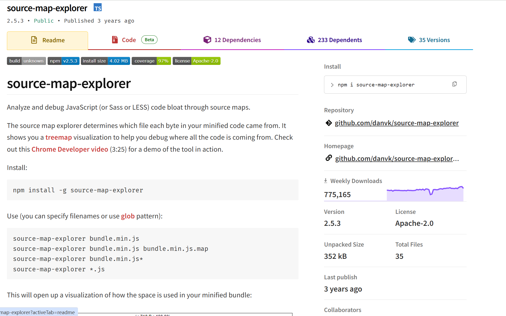

# 使用到的插件

source-map-explorer



# 作用

这将打开一个可视化窗口，展示最小化包中空间的使用情况


# 使用

## 安装

```powershell
npm i source-map-explorer
```

## 配置

在package.json中添加

```json
"scripts": {
    "build": "webpack --mode production --profile --json > stats.json",
    "analyze": "source-map-explorer stats.json"
  },
```
## 查看

然后在命令行运行

```powershell
npm run analyze
```
在浏览器就可以直接查看了，可以挑选体积比较大的包进行优化